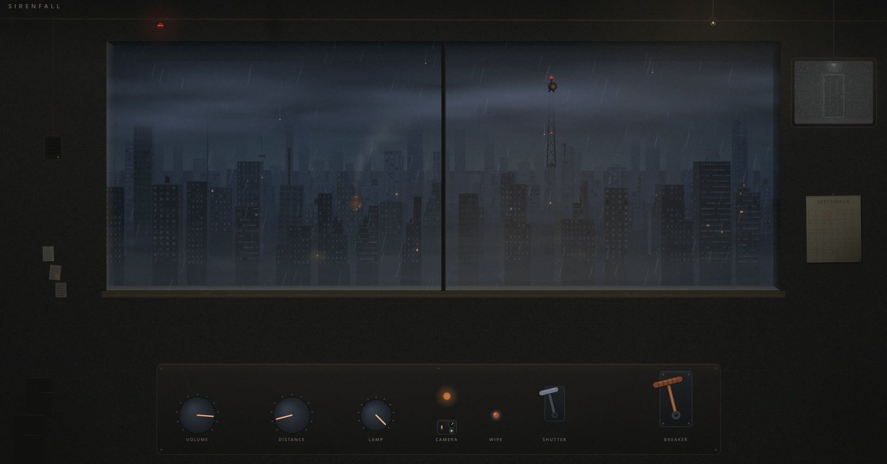

# Sirenfall

A shelter window over a dead city, in the rain. Pull the breaker and a civil-defense siren spins up on the tower across the blocks.

The siren is synthesized live in your browser. It is not a recording.

**Play it: [sirenfall.live](https://sirenfall.live)** (sound on, landscape on phones)



## The siren

- Two port rings chopped at 103 revolutions per second make a 5:6 dual tone, 515 and 618 Hz. The minor third was picked for air raid sirens by the UK Home Office in 1940 for its psychological effect.
- The horn rotates at 4 RPM. Loudness, brightness, Doppler delay, and stereo position follow the horn angle you see on the tower.
- Spin-up growl and the long coast-down fall out of the same rotor physics. Nothing is sampled.
- Distance runs 150 m to 2.8 km with air absorption and city echo.

## The room

Every control is drawn on one canvas: volume, distance, lamp, a door camera, glass wipe, blast shutter, breaker. Weather moves through calm, building, squall, and passing on a slow random walk. Lightning is mostly sheet flashes inside the cloud deck.

## Run it locally

```bash
python -m http.server 8901
```

Open http://localhost:8901. One HTML file, no build step, no dependencies.

Two thunder recordings are left out of the repo for license reasons. The scene falls back to synthesized noise without them. Sources for all four recordings are in [AUDIO-CREDITS.md](AUDIO-CREDITS.md).

## License

MIT for the code. The rain and thunder recordings carry their own licenses, listed in [AUDIO-CREDITS.md](AUDIO-CREDITS.md).
